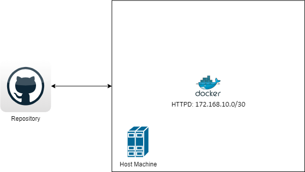

# Automated Container deployment and Administration
## Purpose: 
The objective of this repository is to use Ansible to automate the deployment of a docker container.
## Excecuting the playbook 
```
ansible-playbook -i inventory docker_deploy.yml --ask-become-pass
```
## Diagram

